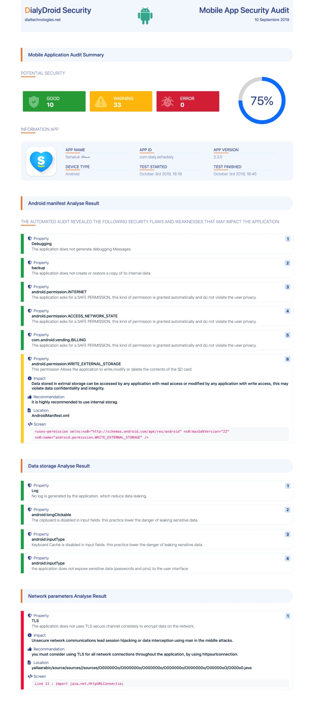

# DialyDroid Security     

## Mobile App Security Audit

[dialtechnologies.net](https://dialydroid.dialy.net/)

## Demo

[Online Demo](https://dialydroid-security.netlify.com/)

## Dependencies

- [Bootstrap] - Bootstrap v4.3.1
- [Ionicons] - Ionicons, v2.0.1
- [FontAwesome] - FontAwesome v5.0.1 (latest)

[bootstrap]: https://getbootstrap.com/
[ionicons]: https://code.ionicframework.com/ionicons/2.0.1/css/ionicons.min.css
[fontawesome]: https://kit.fontawesome.com/dd1a52901c.js

## Contributors

:star2: [ABDELAZIZ EL ARASSI]
